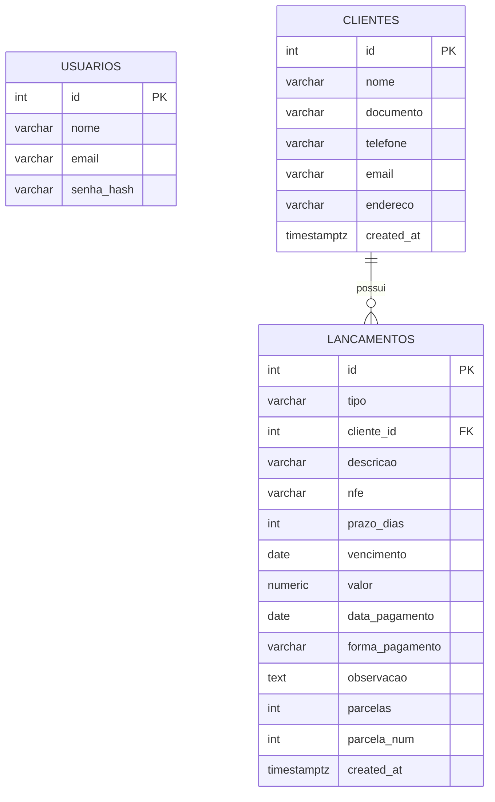

# ⚙️ AMP — ERP para Usinagem Industrial

Sistema ERP web completo desenvolvido como Trabalho de Conclusão de Curso (TCC), voltado para empresas de usinagem de pequeno e médio porte.

> **Stack:** React 18 + Vite · Flask (Python 3) · PostgreSQL (Supabase) · JWT

---

## 📌 Visão Geral

O objetivo deste projeto é centralizar a operação de uma oficina de usinagem em um único sistema moderno, responsivo e acessível via navegador. O ERP integra autenticação segura, gestão de clientes, controle financeiro com importação de NF-e e boletos, e dashboard analítico com dados em tempo real.

---

## 🚀 Tecnologias Utilizadas

### Frontend
| Biblioteca | Versão | Uso |
|---|---|---|
| React | 18 | UI principal |
| Vite | latest | Bundler / Dev server |
| React Router DOM | v6 | Roteamento SPA |
| Tailwind CSS | v3 | Estilização |
| Axios | latest | Requisições HTTP |
| Recharts | latest | Gráficos do dashboard |
| react-hot-toast | latest | Notificações |

### Backend
| Biblioteca | Versão | Uso |
|---|---|---|
| Flask | 3.1.0 | Framework web |
| Flask-SQLAlchemy | 3.1.1 | ORM PostgreSQL |
| Flask-JWT-Extended | 4.7.0 | Autenticação JWT |
| Flask-Cors | 5.0.0 | CORS |
| psycopg2-binary | ≥2.9.11 | Driver PostgreSQL |
| python-dotenv | 1.0.1 | Variáveis de ambiente |
| pdfplumber | latest | Extração de texto em boletos PDF |
| python-dateutil | latest | Cálculo de datas de parcelas |

### Infraestrutura
- **Banco de dados:** PostgreSQL via [Supabase](https://supabase.com) (Session Pooler — IPv4)
- **Deploy sugerido:** Vercel (frontend) · Railway ou Render (backend)

---

## 📂 Estrutura do Projeto

```
tcc-erp-usinagem/
├── backend/
│   ├── app.py              # API Flask — blueprints: /auth, /clientes, /financeiro
│   ├── migrate.py          # Migration manual (adiciona colunas novas)
│   ├── requirements.txt
│   ├── .env                # Variáveis de ambiente (não commitado)
│   └── venv/               # Ambiente virtual Python (não commitado)
│
├── src/
│   ├── assets/             # Ícones e imagens
│   ├── components/         # Componentes reutilizáveis
│   ├── layouts/            # Layouts de página
│   ├── pages/
│   │   ├── AuthPage.jsx    # Login / Cadastro
│   │   ├── Dashboard.jsx   # Dashboard com dados reais
│   │   ├── Clientes.jsx    # CRUD + importação NF-e XML/JSON
│   │   └── Financeiro.jsx  # CRUD + parcelas + boleto PDF
│   ├── api.js              # Instância Axios com token JWT
│   └── App.jsx
│
├── dist/                   # Build de produção (gerado pelo Vite)
├── index.html
├── package.json
├── tailwind.config.cjs
├── vite.config.js
├── .gitignore
└── README.md
```

---

## 🔐 Variáveis de Ambiente

Crie o arquivo `backend/.env` com base no `backend/.env.example`:

```env
# Supabase Session Pooler (IPv4 — porta 5432)
DB_USER=postgres.xxxxxxxxxxxx
DB_PASS=SuaSenhaAqui
DB_HOST=aws-1-sa-east-1.pooler.supabase.com
DB_PORT=5432
DB_NAME=postgres

# Segurança
JWT_SECRET_KEY=chave_jwt_segura_aqui
SECRET_KEY=chave_secreta_aqui
```

> ⚠️ **Nunca commite o `.env`** — ele já está no `.gitignore`.

---

## 🖥️ Como Rodar o Projeto (do zero)

### Pré-requisitos
- [Git](https://git-scm.com/)
- [Python 3.10+](https://www.python.org/)
- [Node.js 18+](https://nodejs.org/)
- Conta no [Supabase](https://supabase.com) com projeto criado

---

### 1. Clonar o repositório

```bash
git clone https://github.com/ConsagradoBr/tcc-erp-usinagem.git
cd tcc-erp-usinagem
```

---

### 2. Configurar o Backend

```bash
# Entrar na pasta do backend
cd backend

# Criar ambiente virtual
python -m venv venv

# Ativar ambiente virtual
# Windows:
venv\Scripts\activate
# Linux/Mac:
source venv/bin/activate

# Instalar dependências
pip install -r requirements.txt

# Criar o arquivo .env com suas credenciais do Supabase
# (copie o .env.example e preencha os valores)
copy .env.example .env     # Windows
cp .env.example .env       # Linux/Mac
```

Edite o `.env` com suas credenciais do Supabase e então rode:

```bash
# Iniciar o servidor backend
python app.py
```

A API estará disponível em: `http://127.0.0.1:5000`

> **Primeira execução:** as tabelas são criadas automaticamente via `db.create_all()`.  
> Se o banco já existia e faltam colunas novas, rode `python migrate.py` uma única vez.

---

### 3. Configurar o Frontend

Abra um **novo terminal** na raiz do projeto:

```bash
# Na raiz do projeto (não dentro de backend/)
cd ..

# Instalar dependências Node
npm install

# Iniciar servidor de desenvolvimento
npm run dev
```

A aplicação abrirá em: `http://localhost:5173`

---

### 4. Criar o primeiro usuário

Com os dois servidores rodando, acesse `http://localhost:5173`, clique em **"Crie uma agora"** e registre seu usuário administrador.

---

## 📊 Módulos Implementados

### 🔐 Autenticação
- Login e cadastro com JWT
- Token com expiração de 8 horas
- Proteção de rotas no frontend e backend

### 👥 Clientes
- CRUD completo (criar, editar, excluir, buscar)
- **Importação automática via NF-e** (`.xml` ou `.json`)
  - Seleciona emitente ou destinatário como cliente
  - Detecção automática de duplicatas por CNPJ/CPF
- Exportar dados do cliente em `.json`
- Máscaras automáticas de CPF/CNPJ e telefone

### 💰 Financeiro
- Lançamentos de contas a pagar e a receber
- **Parcelamento:** cria N parcelas mensais com vencimentos automáticos
- Linha expansível na tabela para visualizar parcelas individuais
- Marcar parcelas como pagas individualmente
- Exclusão em grupo (remove todas as parcelas de um lançamento)
- **Importação via boleto PDF** — extrai valor, vencimento, beneficiário e NF-e automaticamente
- Juros automáticos calculados pelo backend (1% a.m. sobre dias em atraso)
- Status calculado automaticamente: `pendente` / `atrasado` / `pago`
- Filtros por tipo (receber/pagar) e status
- Exportar lançamento em `.csv`

### 📊 Dashboard
- Total de clientes (tempo real)
- A Receber e A Pagar (tempo real via `/financeiro/resumo`)
- Recebido no mês com % de crescimento vs mês anterior
- Gráfico de barras: Receitas x Pagamentos dos últimos 6 meses
- Alerta visual de lançamentos em atraso

---

## 🗄️ Diagrama ER



---

## 🔌 Rotas da API

### Auth — `/auth`
| Método | Rota | Descrição |
|---|---|---|
| POST | `/auth/usuarios` | Cadastrar usuário |
| POST | `/auth/login` | Login (retorna JWT) |
| GET | `/auth/perfil` | Perfil do usuário autenticado |

### Clientes — `/clientes`
| Método | Rota | Descrição |
|---|---|---|
| GET | `/clientes?q=termo` | Listar / buscar clientes |
| POST | `/clientes` | Criar cliente |
| PUT | `/clientes/<id>` | Editar cliente |
| DELETE | `/clientes/<id>` | Excluir cliente |

### Financeiro — `/financeiro`
| Método | Rota | Descrição |
|---|---|---|
| GET | `/financeiro` | Listar lançamentos (filtros: tipo, status, q) |
| GET | `/financeiro/resumo` | Totais para o Dashboard |
| POST | `/financeiro` | Criar lançamento (suporta `parcelas: N`) |
| PUT | `/financeiro/<id>` | Editar lançamento |
| PATCH | `/financeiro/<id>/pagar` | Marcar como pago |
| DELETE | `/financeiro/<id>?modo=unico\|grupo` | Excluir lançamento ou grupo de parcelas |
| POST | `/financeiro/boleto` | Parsear boleto PDF (base64) |

---

## ☁️ Deploy

### Frontend → Vercel
```bash
npm run build
# Faça upload da pasta dist/ ou conecte o repositório GitHub no Vercel
# Framework: Vite
```

### Backend → Railway / Render
1. Conecte o repositório GitHub
2. Defina as variáveis de ambiente (as mesmas do `.env`)
3. Comando de start: `python app.py`

---

## 🧭 Roadmap Futuro
- [ ] Módulo de Ordens de Serviço (OS)
- [ ] Módulo de Estoque
- [ ] Multiusuários com níveis de acesso (admin / operador)
- [ ] Notificações em tempo real (WebSocket)
- [ ] Integração com NF-e (SEFAZ)
- [ ] Relatório OEE para máquinas CNC
- [ ] Aplicativo mobile (React Native)

---

## 👨‍💻 Autores

**Quesede Constantino**  
Desenvolvedor Fullstack — TCC: ERP para Usinagem Industrial

**Lucas Vital Davoli**  
Desenvolvedor — TCC: ERP para Usinagem Industrial

**A definir**  
— TCC: ERP para Usinagem Industrial

---

## 📄 Licença

Projeto acadêmico desenvolvido para fins de TCC. Todos os direitos reservados.
